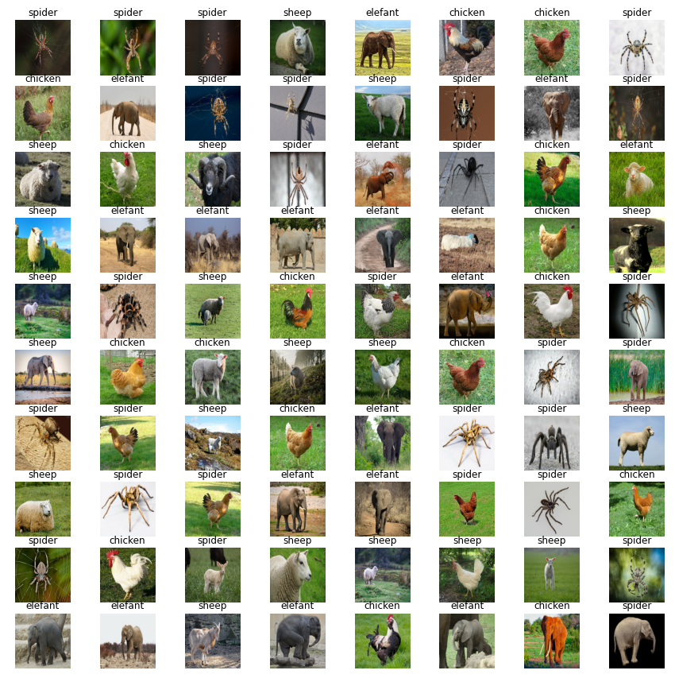

# AKT-Image-Classification-Blaha-Piringer-Gratzl
## Team
 - Blaha Dominik
 - Piringer David
 - Gratzl Maximilian
 
## Task
Image-Classification of following animals:
 - chicken
 - elefant
 - sheep
 - spider

## Dataset
[Dataset URL](https://www.kaggle.com/alessiocorrado99/animals10)

For our task we used 100 pictures each for training our model. This pictures were split into training and validation images by the ratio of 80%/20%. Additional 20 pictures per class were used for testing our model.

## Challenges
### Selection of a dataset
The selected dataset contained a lot of pictures that showed only parts of animals or even completely different animals.
We decided to remove such images from the dataset which dramatically increased the accuracy of the network. First we tried to classify 10 different animals which lead to a too complex model and low accuracy. After focusing on chicken, elefants, sheep and spiders and selecting good suited images the accuracy increased.

### Overfitting
As we encountered massive overfitting (training accuracy was much higher than the validation accuracy) we tried to mitigate this problem with following actions:
 - Addition of dropout layers
 - Usage of a `kernel_regularizer` (`l2`)

## End Result

After trying various hyperparameters and model configurations we achieved an accuracy of about 80%. The following images show the results:

## Confusion Matrix

The confusion matrix shows that the true labels mostly fit the predicted labels.

